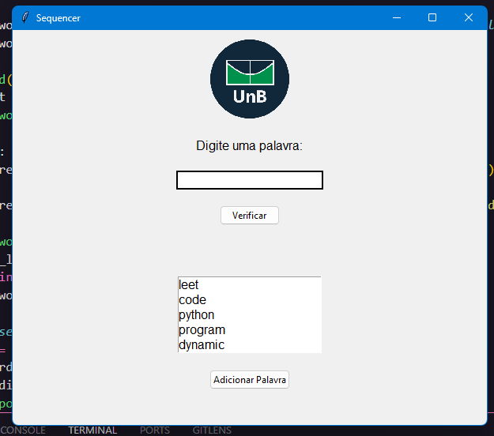
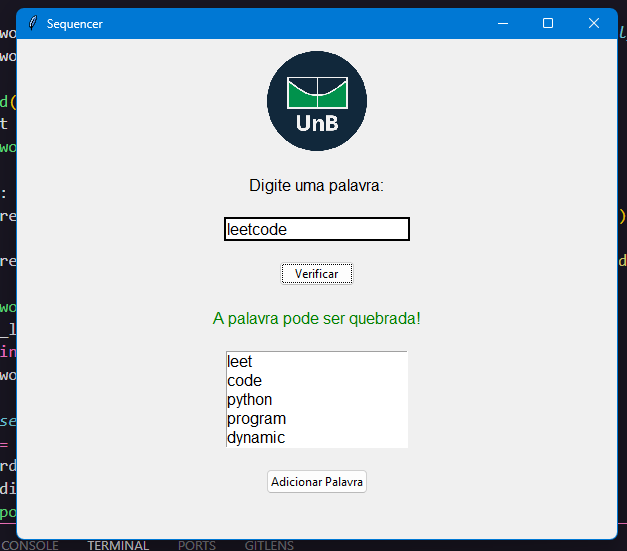
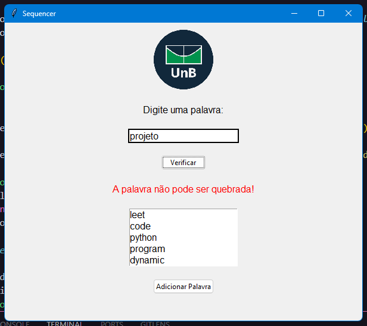
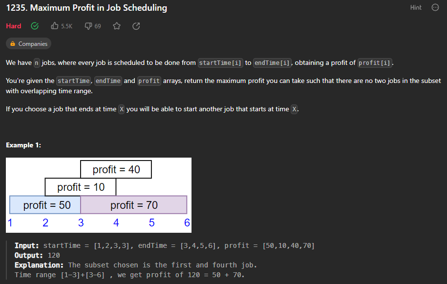
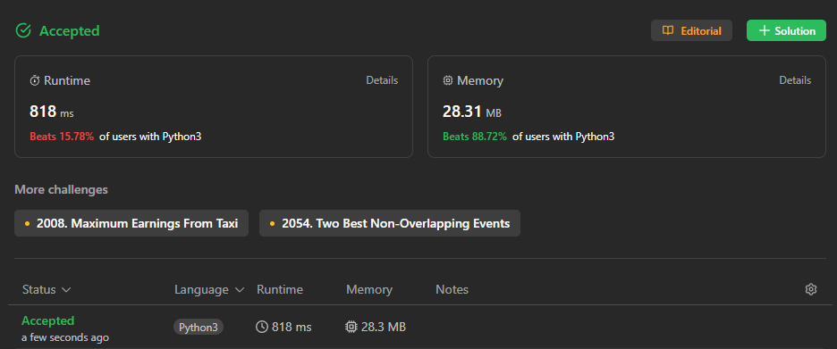
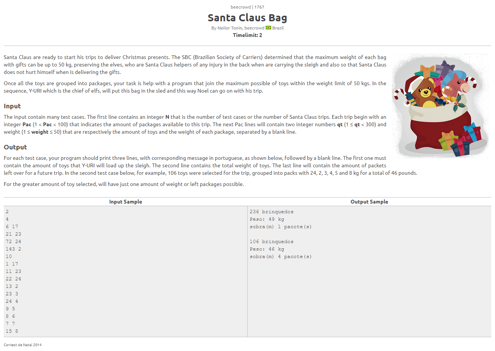
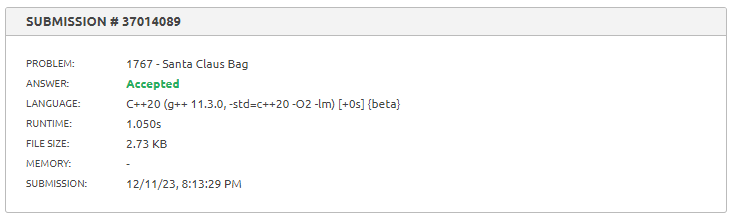
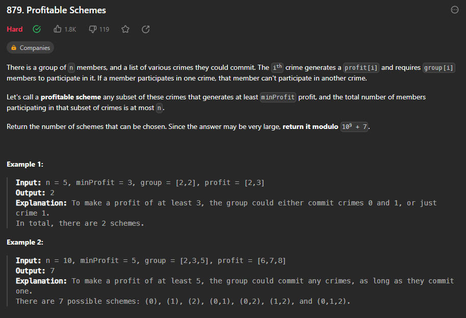
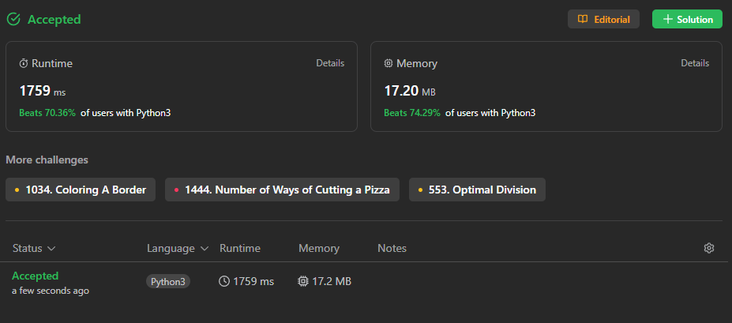

# Exercícios de Juiz Online e Sequencer

**Conteúdo da Disciplina**: Programação dinâmica<br>

## Alunos
| Matrícula  | Aluno                           |
| ---------- | ------------------------------- |
| 17/0020291 | Paulo Henrique Almeida da Silva |
| 19/0023376 | Abraão Alves Ribeiro            |

## Sobre 
Nosso foco principal foi aprimorar habilidades em programação dinâmica, uma técnica essencial na resolução de problemas algorítmicos desafiadores. Dedicamos tempo significativo à resolução de desafios em juízes online, visando fortalecer nossa proficiência nessa abordagem.

Destacamos a aplicação de estratégias de programação dinâmica nos desafios propostos pelas plataformas, que envolvem quebrar problemas complexos em subproblemas menores, promovendo uma compreensão profunda dos algoritmos.

Além disso, investimos tempo em um projeto prático específico: o desenvolvimento do Sequencer. Este projeto consolida conceitos de programação dinâmica, oferecendo uma aplicação tangível dessa abordagem. O Sequencer é uma ferramenta para alinhamento de sequências. 

## Screenshots

### Sequencer




### Exercícios
#### [A - Maximum Profit in Job Scheduling](https://leetcode.com/problems/maximum-profit-in-job-scheduling/description/) 



#### [B - ]() 



#### [C - ]()



#### [D - ]()


## Instalação 
**Linguagem**: Python<br>

Para executar os exercícios e o projeto Sequencer, você deve ter a seguinte linguagem instalada em sua máquina:

- Python 3.x

**Biblioteca**: pillow <br>
Para executar o projeto Sequencer, você deve ter a seguinte biblioteca instalada em sua máquina:

- pillow 10.x.x

## Uso 
Para utilizar nosso projeto, siga o passo a passo abaixo:

### Resolução de Exercícios em Juízes Online
Acesse o diretório do exercício. Para os exercícios, navegue até o diretório correspondente (A, B, C ou D).

Execute o comando Python:

``` 
$ python nome_do_arquivo.py
``` 

para executar a solução do exercício.
Substitua "nome_do_arquivo.py" pelo nome do arquivo correspondente ao exercício (A.py, B.py, etc.).

### Quebra de palavras (Sequencer)
Acesse o diretório do projeto de tarefas. Navegue até o diretório "Sequencer".

Execute o comando Python:

```
$ python sequencer.py
``` 
para iniciar o Sequencer.

> Explore as funcionalidades do Sequencer!

Siga as instruções abaixo para interagir com eficiência no Sequencer. Antes de começar, certifique-se de ter o Python instalado em seu ambiente.

#### Adicionar Palavras:

Digite uma palavra na caixa de entrada.
Clique no botão 'Adicionar Palavra' para incluir a nova palavra no dicionário.
A lista de palavras será automaticamente atualizada.

#### Verificar Quebra de Palavras:

Digite uma palavra na caixa de entrada.
Clique no botão 'Verificar' para descobrir se a palavra pode ser quebrada com base no dicionário.

#### Visualizar Palavras do Dicionário:

A lista de palavras do dicionário é exibida na parte inferior da janela.
Ela é atualizada automaticamente quando novas palavras são adicionadas.

## Apresentação
> - [Vídeo de apresentação](./)


